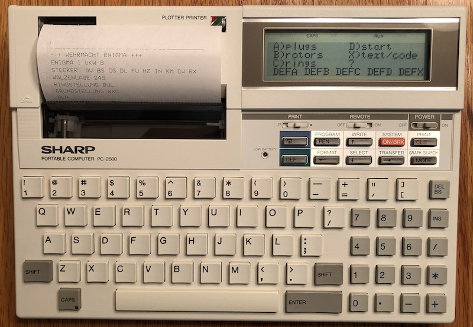

# Enigma

An Enigma machine for SHARP pocket computers.

This program was written as a result of a class project on cyber security.
I thought it would be fun to rewrite in BASIC to run on SHARP pocket computers.

Recommended reading:

- [The code book](https://simonsingh.net/books/the-code-book) (Simon Singh)
- [Enigma machine](https://en.wikipedia.org/wiki/Enigma_machine) (wikipedia)
- [Enigma cipher machine simulator](https://math.dartmouth.edu/~jvoight/Fa2012-295/EnigmaSimManual.pdf) (Darthmouth)

The program is written from scratch and does not use any code from any existing
Enigma simulators.

The program simulates the Enigma I machine UKW B and C with 1 to 5 rotors.  It
has been tested with real WW2 secret messages.

The program runs on SHARP PC-1350/1360/2500.  A slimmed-down version runs on
SHARP PC-126x/1475.

## Instructions

`RUN` initializes the system, which takes a few seconds.  Then it will ask
if you want to print the output `PRINT (y/N)`.  If you reply `Y[ENTER]` then
the system will ask `PRINT KEYS (Y/n)`.  Reply `Y[ENTER]` to print secret keys,
which is not recommended if you want to keep your secret keys a secret.
Optionally you can print a heading text `HEADING TEXT TO PRINT?` by typing it
in followed by `[ENTER]`, which will be printed as a heading.  You can use this
to add information for the recipient.

Next you will need to specify the Enigma UKW, enter `B` (default) or `C`.

There are five steps that can be executed in order, or individually selected
from the menu, or selected at any time with a DEF key:

1. DEF-A: select plugboard settings by entering pairs of letters
2. DEF-B: select scramblers, left-to-right, specified by three numbers 1 to 5
3. DEF-C: specify ring settings, left-to-right, enter three letters
4. DEF-D: specify starting position, left-to-right, enter three letters
5. DEF-X: enter the text to encode or decode

DEF-SPACE returns to the menu.

## Example decryption

This message deciphering example follows the operating procedure performed by
an Enigma operator (the full deciphering is not shown but replaced with
`.....`).  Each value input is followed by `[ENTER]`.   Text to decipher can be
entered with spaces to group letters, but spacing is ignored and is not
required.

    ENIGMA UKW (B/C) B                   (Enigma B type)
    STECKERVERBINDUNG PO                 (plugboard settings)
    STECKERVERBINDUNG ML
    STECKERVERBINDUNG IU
    STECKERVERBINDUNG KJ
    STECKERVERBINDUNG NH
    STECKERVERBINDUNG YT
    STECKERVERBINDUNG GB
    STECKERVERBINDUNG VF
    STECKERVERBINDUNG RE
    STECKERVERBINDUNG DC
    STECKERVERBINDUNG [ENTER]
    WALZENLAGE 125                       (scrambler arrangement)
    RINGSTELLUNG FVN                     (scrambler orientation)
    GRUNDSTELLUNG EHZ                    (start position to retrieve message key)
    ?TBS                                 (decrypt the message key)
    XWB                                  (the message key to decrypt text)
    [DEF-D]
    GRUNDSTELLUNG XWB                    (start position to decrypt text)
    ?QBLTW LDAHH YEOEF PTWYB
    DERFU ..... ..... .....
    ?LENDP MKOXL DFAMU DWIJD
    KAMPF ..... ..... .....
    ?XRJZ
    ITZX
    ?[ENTER]
    END

## Example encryption

This message encoding example follows the operating procedure performed by an
Enigma operato (the full ciphertext is not shown).  Each value input is
followed by `[ENTER]`.   Text to decipher can be entered with spaces to group
letters, but spacing is ignored and is not required.

Note that the random start position key and encrypted message key are shared
with the receiver by including `EHZ TBS` in the message sent.  To do so, enable
print and include `EHZ` in the print heading text.  `TBS` is printed as the
cipher of the plain message key `XWB` entered as text to encrypt.  The heading
text may also be used to send the key identification group of five letters.

    ENIGMA UKW (B/C) B                   (Enigma B type)
    STECKERVERBINDUNG PO                 (plugboard settings)
    STECKERVERBINDUNG ML
    STECKERVERBINDUNG IU
    STECKERVERBINDUNG KJ
    STECKERVERBINDUNG NH
    STECKERVERBINDUNG YT
    STECKERVERBINDUNG GB
    STECKERVERBINDUNG VF
    STECKERVERBINDUNG RE
    STECKERVERBINDUNG DC
    STECKERVERBINDUNG [ENTER]
    WALZENLAGE 125                       (scrambler arrangement)
    RINGSTELLUNG FVN                     (scrambler orientation)
    GRUNDSTELLUNG EHZ                    (randomly selected start position key to share)
    ?XWB                                 (randomly selected message key)
    TBS                                  (encrypted message key to share)
    [DEF-D]
    GRUNDSTELLUNG XWB                    (start position to decrypt text)
    ?.....
    ?[ENTER]
    END

## A challenge

To learn how to use an Enigma machine in general, try the "Authentic Wartime
Message from the Russian Front" published in the [Enigma cipher machine
simulator](https://math.dartmouth.edu/~jvoight/Fa2012-295/EnigmaSimManual.pdf)
manual.

## How to load

Use the excellent [PocketTools](https://www.peil-partner.de/ifhe.de/sharp/)
to convert BASIC source code to wav files:

    bas2img --pc=1350 --level=8 enigma.bas
    bin2wav --pc=1350 enigma.img

Then `CLOAD` on your pocket computer.

Author: Dr. Robert A. van Engelen
